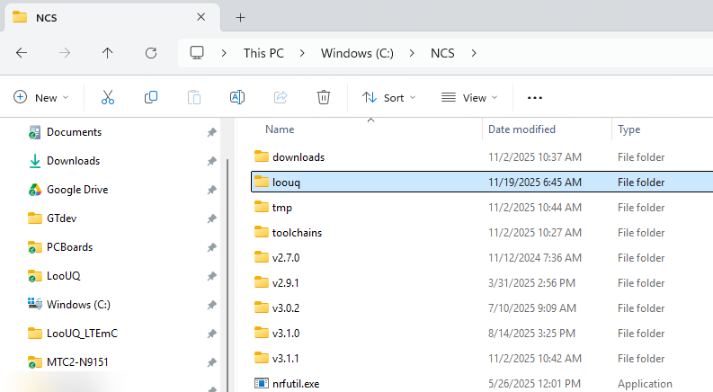

# LooUQ MTC2 Software Development Resources
 
 ## Board Definitions, Drivers, and Samples

This repository holds resources to create software for LooUQ's MTC.2 product line. This includes the MTC2-N9151.

## Installing on your workstation
The repository is design to sit in the top level of your NCS (Nordic Connect SDK) folder. Here at LooUQ NCS is installed at **C:\NCS** and this the parent folder for the LooUQ MTC.2 resources repository. While the repository name is "LooUQ-MTC2-SW", we have it installed at **C:\NCS\loouq**. Nordic's development environment can push the limits for path lengths, so attempting to keep the folder names as short as possible while still being identifyable. The examples showing how to integrate these resources into **nRF Conect for VS Code** development environment assume this path. If you wish to install them somewhere else, please adjust the examples shown to your environment.

LooUQ is still evaluating how to best pattern working with NCS and Zephyr. Currently this repo follows the ***out-of-tree*** approach for devicetree and application use. For applications, this is known as a **Freestanding Application**.

### Copying the repository
You copy the repository however you would normally for any other Git repo. Again... recommend it go into the NCS top-level folder above your installed SDK versions.

Non-Image content-type returned
### Adding to the board root
Since the NCS extension doesn't know about ***out-of-tree*** resources, we have to tell it about the LooUQ boards. This is done once, in VS Code settings.
* Open Settings in VS Code
* Navigate the Extensions (left side list) to **nRF Connect**
* Look for **Board Roots** 
* Add a entry for "C:\NCS\loouq\boards"
* Save your entry

### DTS (aka Devicetree)
In addition to the board files, LooUQ provides some DTS resources in the form of bindings. nRF Connect expects them in a DTS folder below boards when located ***out-of-tree***. So for the installation suggested, that would be C:\NCS\loouq\boards\dts

## Building Applications
...underway

